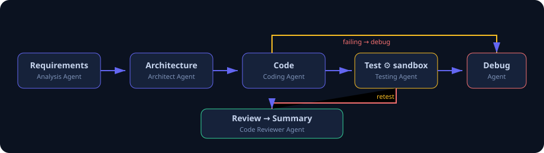

# Agentic AI Software Development & Debugging Assistant

A multi-agent system that converts software requirements into **tested and reviewed**
implementations. Specialized AI agents collaborate inside a LangGraph state machine:
requirements → architecture → code generation → automated test execution → debugging →
retesting → code review → documentation.

The system runs a **real code → test → debug → retest loop**: generated code is executed
inside an isolated sandbox, failures are parsed, patched by the debugging agent, and
re-tested until green. Code is never green-lit without automated validation.



---

## Features

| Requirement | Implementation |
| --- | --- |
| Requirement Analysis Agent | Converts the request into a technical spec + acceptance criteria (`app/agents/requirement_agent.py`) |
| Architect Agent | Produces modules, APIs, data models, dependencies as structured JSON |
| Coding Agent | Generates the full source tree into an isolated workspace + git repo |
| Testing Agent | Writes pytest suites, installs deps in a fresh venv, executes in a sandbox |
| Debugging Agent | Reads JUnit failures, patches source, requests a retest (tool calling) |
| Code Reviewer Agent | Scores 0-100: security, maintainability, requirement coverage |
| Development Status live view | Planning / Coding / Testing / Debugging / Reviewing / Completed via SSE |
| Isolated code execution | Per-project workspace + dedicated virtualenv, time-bounded subprocesses |
| Test execution results | Parsed from JUnit XML; table + full pytest output in the UI |
| Errors identified & corrections | Unified diffs rendered in the dashboard; debug explanations |
| Agent memory | Redis-backed (in-memory fallback), per-project recall |
| Git integration | Staged commits per stage; history shown in UI |
| Code-diff visualization | `diff.py` unifies before/after; `DiffView` renders +/- lines |
| Execution logs | Streamed live + persisted in state |
| PostgreSQL / Redis | Optional via `DATABASE_URL` / `REDIS_URL` (SQLite / in-memory fallbacks) |
| Tool calling | LLM debugging uses `read_file`, `write_file`, `list_files`, `run_tests` function calls bound to the sandbox |

## Tech Stack

- **Backend**: Python · FastAPI · LangGraph · Pydantic v2 · SQLAlchemy (async) · SSE
- **LLM**: OpenAI (gpt-4o-mini default) with a **deterministic mock provider** for keyless demos
- **Frontend**: React 18 · TypeScript · Tailwind CSS 4 · Vite
- **Infrastructure**: Docker · pytest · PostgreSQL · Redis · Git

---

## Quickstart (no API key — free demo)

The mock provider generates a realistic FastAPI task API **seeded with two defects**,
then runs the real loop until they are found, fixed, and verified green. This proves the
whole pipeline end-to-end without spending anything.

```powershell
# 1. backend
cd backend
python -m venv .venv
.\.venv\Scripts\python.exe -m pip install -r requirements.txt
.\.venv\Scripts\python.exe -m uvicorn app.main:app --reload --port 8000

# 2. frontend (new terminal)
cd frontend
npm install
npm run dev
```

Open **http://localhost:5173**, paste a requirement, press **Run Pipeline**, and watch the
live stage feed: tests will fail → debug agent patches → retest passes → review signs off.

Or run everything with one script:

```powershell
.\start-dev.ps1        # backend + frontend in dev mode
```

## Enable real LLM generation (needs an OpenAI API key)

OpenAI API keys are usage-based (small pay-as-you-go cost, no subscription). Add yours to
`backend/.env`:

```
OPENAI_API_KEY=sk-...
OPENAI_MODEL=gpt-4o-mini
```

Restart the backend. `GET /health` now reports `provider=openai`, and all six agents drive
real generations with tool calling during debugging.

---

## API

| Method | Endpoint | Description |
| --- | --- | --- |
| `GET` | `/health` | Health + active provider + memory backend |
| `POST` | `/api/projects` | Start a development pipeline `{requirement}` |
| `GET` | `/api/projects` | List projects |
| `GET` | `/api/projects/{id}` | Full workflow state & artifacts |
| `GET` | `/api/projects/{id}/events` | **SSE** live stage updates |
| `GET` | `/api/projects/{id}/memory` | Agent memory traces (optionally `?agent=`) |
| `POST` | `/api/projects/{id}/rerun` | Restart the pipeline |

Interactive docs at **http://localhost:8000/docs**.

---

## Testing

```powershell
cd backend
.\.venv\Scripts\python.exe -m pip install pytest
.\.venv\Scripts\python.exe -m pytest tests -q
.\.venv\Scripts\python.exe scripts\e2e_check.py   # boots a live server + SSE + full run
```

The suite asserts the mock project really is **buggy on first run and green after the
debug loop**, and that the LangGraph pipeline reaches `completed` with ≥1 correction
diff and a passing review.

---

## Docker

```powershell
# optionally set OPENAI_API_KEY for real generation
$env:OPENAI_API_KEY="sk-..."   # or leave blank for mock mode

docker compose up --build
```

- Frontend: http://localhost:5173
- Backend: http://localhost:8000/docs
- PostgreSQL + Redis boot inside the compose stack.

---

## Deployment

### Backend → Render

1. Create a **Web Service** on Render from this repo (root dir = `backend`, build =
   `pip install -r requirements.txt`, start = `uvicorn app.main:app --host 0.0.0.0 --port 8000`).
2. Add env vars: `OPENAI_API_KEY`, optional `DATABASE_URL` (Render Postgres) and
   `REDIS_URL` (Render Redis), `CORS_ORIGINS=https://your-frontend.vercel.app`.
3. `WORKSPACE_ROOT` should point to an ephemeral or mounted volume (`/var/data/workspaces`).

### Frontend → Vercel

1. Import the repo, root dir = `frontend`, framework = **Vite**.
2. Build `npm run build`, output `dist`.
3. Set `VITE_API_BASE=https://your-render-backend.onrender.com`.
4. Deploy. (Rewrite rule `/* -> /index.html` for SPA routing.)

---

## Project Layout

```
backend/
  app/
    agents/            # the six specialized agents
    api/routes.py      # REST + SSE endpoints
    llm/               # OpenAI provider (tool calling) + mock provider
    sandbox/executor.py# isolated venv + pytest execution + JUnit parsing
    workflow/graph.py  # LangGraph state machine & debug->retest loop
    diff.py, gitrepo.py, memory.py, db.py, schemas.py, config.py
  tests/               # workflow + API tests
  scripts/e2e_check.py # live server end-to-end check
frontend/
  src/                 # React + TS + Tailwind dashboard
docker-compose.yml     # backend + frontend + postgres + redis
start-dev.ps1
```

## How the debug loop works

1. `code` node writes the generated source into `workspaces/<project_id>` and commits it.
2. `test` node writes pytest files, creates a fresh venv, installs deps, runs pytest,
   parses the JUnit report.
3. `_decide` routes by outcome:
   - `failed == 0 and error == 0` → **review**
   - more attempts left → **debug** (patches source) → **test** (retest) …
   - attempts exhausted → **failed**
4. `review` scores the final green implementation; `finalize` writes the summary.